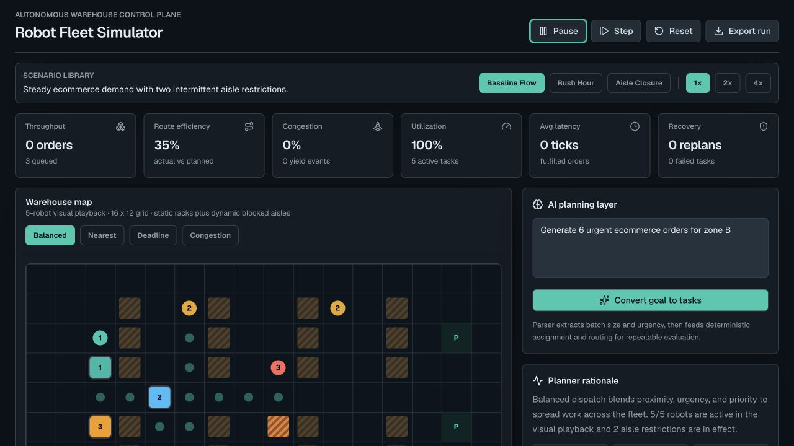
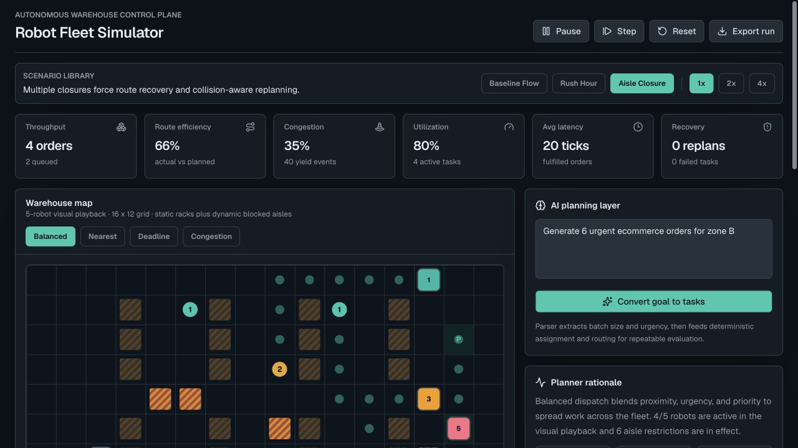

# Demo walkthrough

This is the fastest way to get a feel for the simulator before reading the code.

## 1. Start with a normal fulfillment run

Choose **Baseline flow** and let the fleet run. The top row is the quick health check: throughput, route efficiency, congestion, utilization, fulfillment latency, and recovery events. The grid is the visual playback; colored squares are robots, numbered circles are pick tasks, and `P` cells are pack stations.

## 2. Create an aisle disruption

Choose **Aisle closure**, press **Run**, and use **Block aisle** or select an open map cell. Active robots yield when a proposed move is unsafe, then the routing layer can replan around the new restriction. The fleet panel on the right makes this visible without requiring you to inspect the grid one cell at a time.

## 3. Compare policy behavior

The dispatch controls above the map switch between four policies:

- **Balanced** combines distance, urgency, and task priority.
- **Nearest** favors the shortest pickup distance.
- **Deadline** prioritizes SLA risk.
- **Congestion** penalizes work near restricted or high-demand areas.

The visual playback is deliberately small enough to read. The **Scale validation harness** at the bottom of the app is the separate deterministic evaluator: it runs 50 robots against 500-order waves across 100 fixed seed bundles and reports the checked benchmark outcome.

## 4. Make it your own

Type a goal such as `Generate 10 urgent orders for zone C` into the AI planning panel, then select **Convert goal to tasks**. The parser keeps that input deterministic by extracting only the batch size and urgency. You can also inject a single order, switch scenarios, change simulation speed, step one tick at a time, reset the run, or export the current state.
